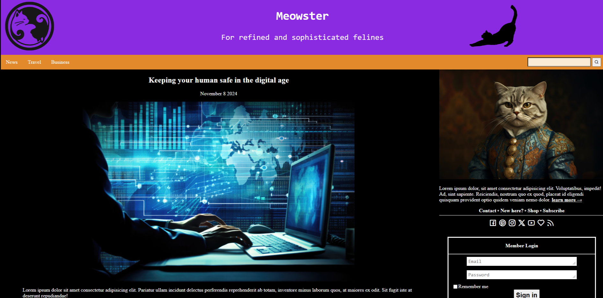
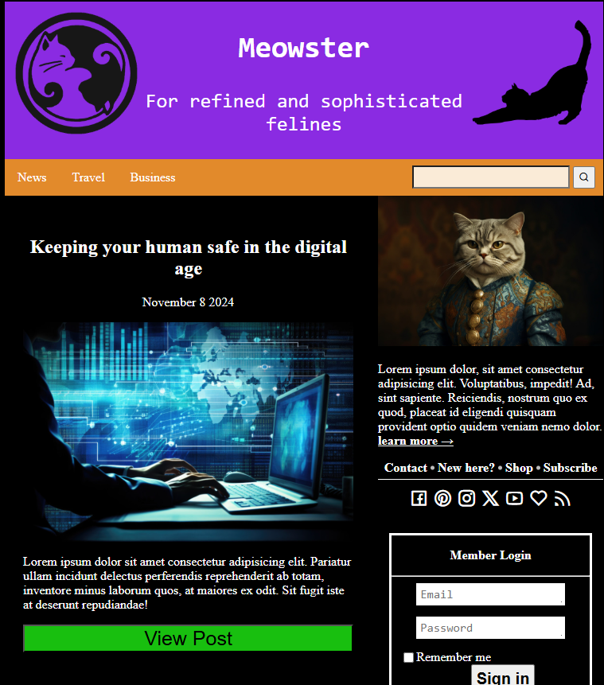
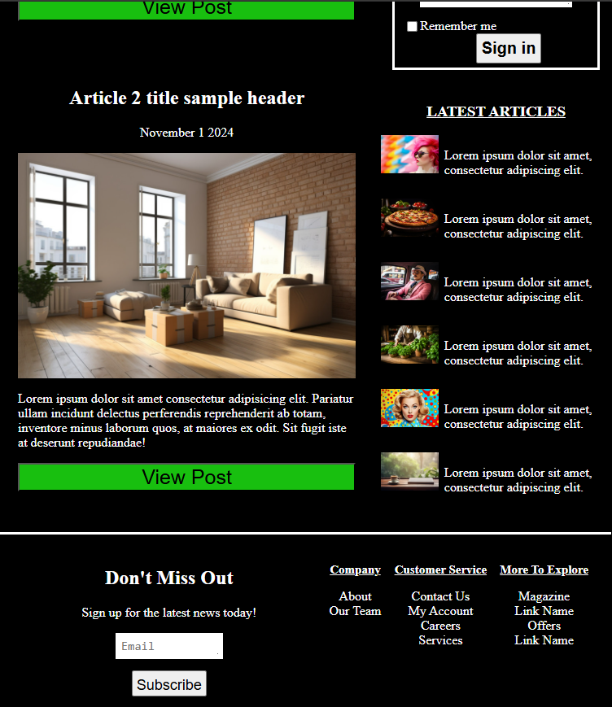
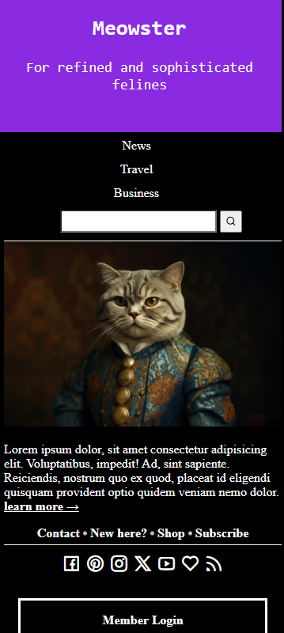
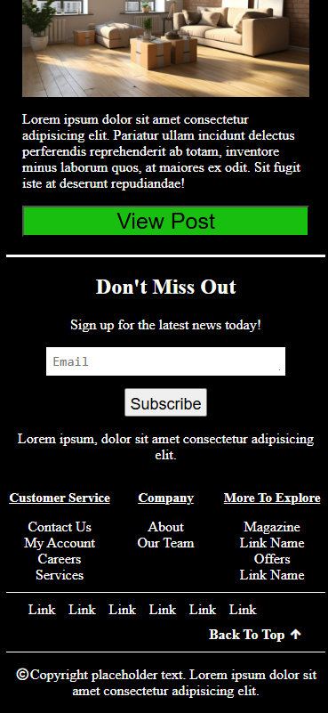

# Meowster: News Blog Template 
  

Live Page: https://rubinod1.github.io/Meowster/

GitHub Repo: https://github.com/RubinoD1/Meowster

## What is Meowster? 

Meowster is a news blog template that make use of CSS grid layout. 

## Screenshots

Desktop Layout

 

Tablet Layout

 
    

Phone Layout

 

  

  

